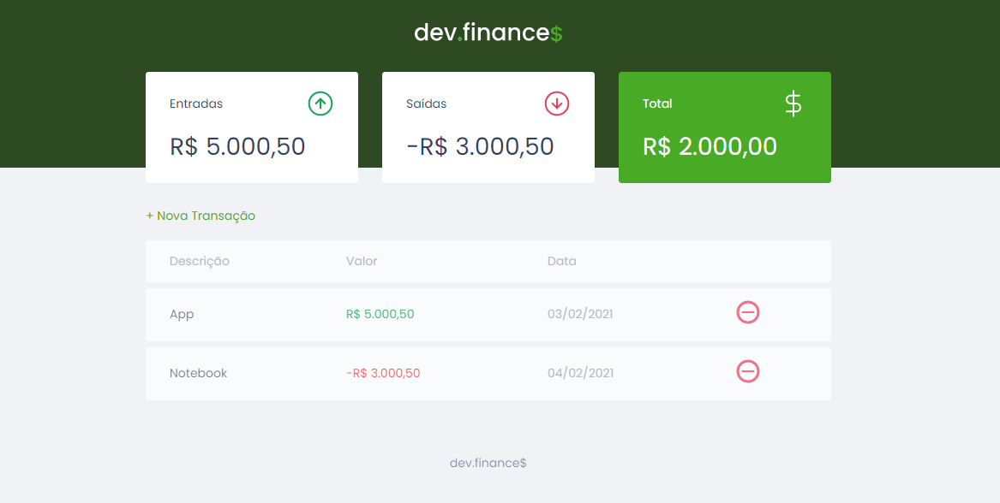

<h1 align="center">
    
</h1>

# 💰 Dev Finances 
Aplicação desenvolvida durante a Maratona Discover da Rocketseat que permite adicionar e remover transações para auxiliar a organização financeira.

## 💻 Projeto
### Tecnologias
- HTML
- CSS
- JavaScript

## 🔧 Executar no seu PC

- Clone esse repositório;
- Adicione a extensão "Live Server" do VS Code;
- Clique com o botão auxiliar no arquivo index.html e selecione a opção "Open with Live Server".

## 🤔 Como contribuir

- Faça um fork desse repositório;
- Crie uma branch com as suas alterações: `git checkout -b my-feature`;
- Commit suas alterações: `git commit -m 'feat: my new feature'`;
- Faça um push para a sua branch: `git push origin my-feature`.

## 📜 Licença

> Este projeto está sob a licença MIT. Veja o arquivo [LICENSE](https://github.com/jessicafpx/dev-finances/blob/main/LICENSE.md) para mais detalhes.

---

##### 
 <strong> < desenvolvido por <a href="https://github.com/jessicafpx"> @jessicafpx</a> /> </strong> 👋
